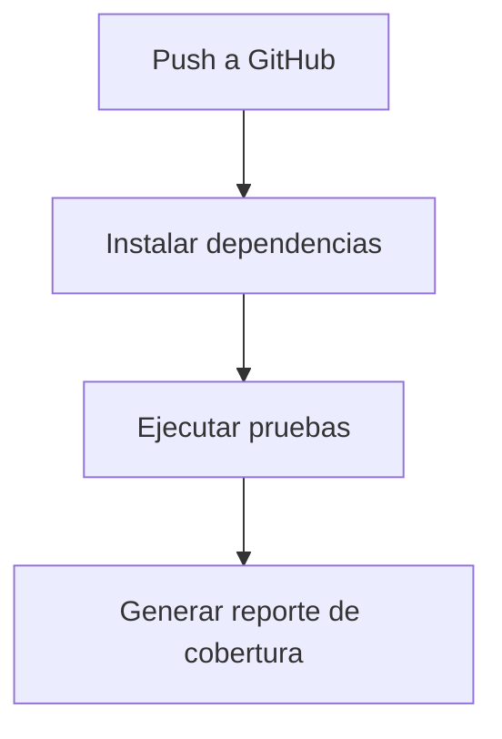

```md
# CI Report – Proyecto CI/CD

## Pipeline


Métricas

Tests implementados: 3
Cobertura: 100%
Estado del pipeline: Exitoso (GitHub Actions)

Decisiones

Se utilizó Node.js con Express para simplicidad
Jest para pruebas automatizadas
GitHub Actions para integración continua
El pipeline ejecuta instalación y pruebas en cada push

Feedback Loops

El sistema implementa un feedback loop automático donde cada push al repositorio activa el pipeline de CI/CD. 
Esto permite detectar errores rápidamente mediante la ejecución automática de pruebas, proporcionando retroalimentación inmediata al desarrollador.
Este loop reduce el tiempo de detección de fallos y mejora la calidad del código de forma continua.

Conclusión

El proyecto implementa un flujo básico de CI/CD asegurando calidad mediante pruebas automáticas en cada cambio.